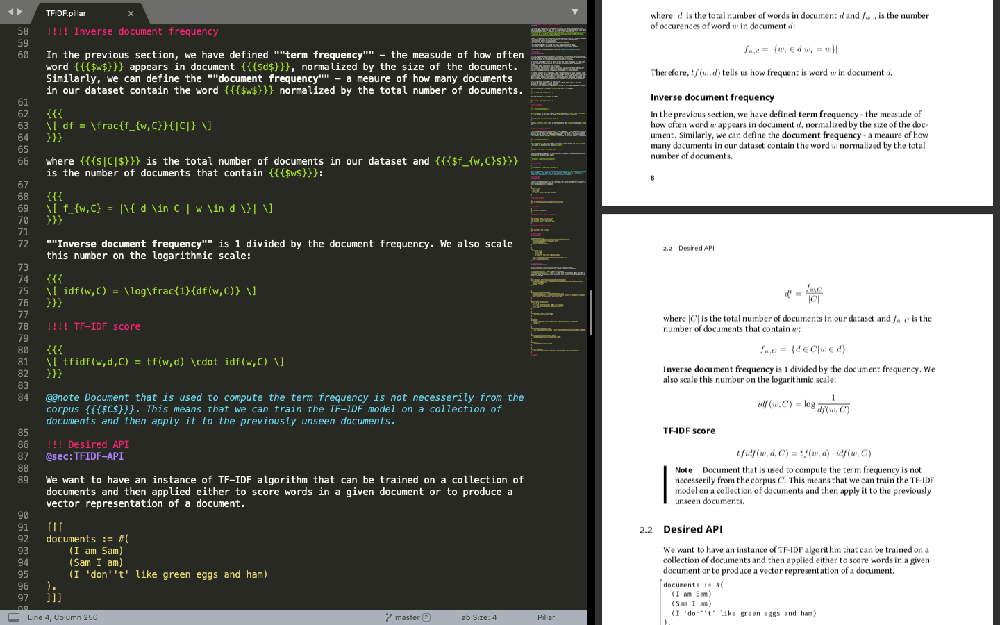

# Pillar Syntax Highlighting for Sublime Text

Add support for [Pillar](https://ci.inria.fr/pharo-contribution/job/EnterprisePharoBook/lastSuccessfulBuild/artifact/book-result/PillarChap/Pillar.html) markup language to your [Sublime Text](https://www.sublimetext.com/) editor.

## How to Install?

### Option 1

1. Click `Tools > Developer > New Syntax...` in the top menu of your Sublime Text editor. You will see the YAML template for defining a new syntax.
2. Select everything and replace it with the contents of [Pillar.sublime-syntax](Pillar.sublime-syntax) file.
3. Press `Save` or `Ctrl+S`, call your new file _"Pillar.sublime-syntax"_.
4. Open any file with `.pillar` extension

### Option 2

1. Click `Sublime Text > Preferences > Browse Packages`. It will open a directory with packages.
2. Navigate into `User` folder.
3. Copy [Pillar.sublime-syntax](Pillar.sublime-syntax) into that location.
4. Open any file with `.pillar` extension

## How to Contribute?

If you find a bug or want to improve the highlighting, please create an issue in this repository or submit a pull request.

## Useful Resources

1. [Syntax Definitions](https://www.sublimetext.com/docs/3/syntax.html)
2. [Scope Naming](https://www.sublimetext.com/docs/3/scope_naming.html)
3. [Color Schemes](https://www.sublimetext.com/docs/3/color_schemes.html)